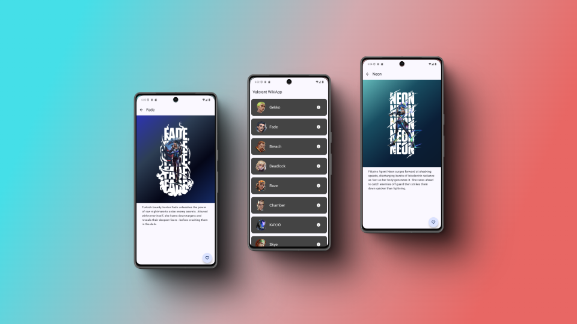

# Valorant Wiki App

 

## Descripción
Valorant Info App es una aplicación Android diseñada para mostrar información e imágenes relacionadas con el popular juego Valorant. La aplicación utiliza la API de Valorant para proporcionar detalles actualizados sobre agentes, mapas, armas y más.

Este proyecto fue creado con el propósito de aprender y aplicar conceptos avanzados de desarrollo de software, incluyendo arquitectura limpia (Clean Architecture), MVVM, y principios SOLID, además de diversas herramientas de desarrollo modernas.

---

## Características
- **Interfaz moderna y responsiva:** Construida con Jetpack Compose.
- **Acceso a datos en tiempo real:** Integración con la API de Valorant mediante Retrofit.
- **Gestión local de datos:** Implementación de Room para almacenamiento en caché.
- **Patrones arquitectónicos:** Aplicación de Clean Architecture y MVVM.
- **Flujo reactivo:** Uso de StateFlow para la gestión de estado.
- **Testing robusto:** Pruebas unitarias, integrales y de UI utilizando Mockito y Espresso.

---

## Tecnologías y herramientas
- **Lenguaje:** Kotlin
- **Arquitectura:** Clean Architecture con MVVM
- **UI:** Jetpack Compose
- **Red:** Retrofit
- **Base de datos:** Room
- **Gestión de estado:** StateFlow
- **Testing:**
  - Pruebas unitarias con Mockito
  - Pruebas de integración
  - Pruebas de UI con Espresso

---

## Contacto

Si tienes preguntas o sugerencias, no dudes en contactarme:
- **Email:** alejandrohm98a@gmail.com
- **GitHub:** [@tuusuario](https://github.com/Alex3034)

---

¡Gracias por visitar este repositorio! Espero que encuentres útil este proyecto y te inspire en tus propios desarrollos.
